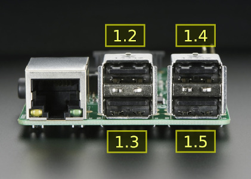

# README #

Extracts information on USB devices attached to a Raspberry Pi, mapping physical ports to device files.

Serial device files (such as `/dev/ttyUSB0`) in a Raspberry Pi are enumerated in the order they are plugged in. But if the system boots with the devices already attached, there is no way to predict the order, which might change after rebooting, even without any modifications in the setup. This library solves this problem.

Each physical port has a corresponding identifier using a numbering system representing the *hub hierarchy*, where each level is separated by a dot. The internal USB controller in the Raspberry Pi is regarded as the top-level hub, and assigned the number **1**. Each port in this hub has a number ranging from 1 to 5, where port 1 is internally connected to the Ethernet controller and the remaining ports are available at the physical connectors. Therefore, the physical port identifiers range from `1.2` to `1.5` as below:

\
*(Raspberry Pi photo from adafruit.com)*


If a USB hub is connected to any of those ports, it adds a new hierarchy level below, where each of its ports receive a new number. So if a hub is connected at port `1.4`, its second physical connector will be identified as `1.4.2`.

The critical point here is ***this association does not change across boots***.

This library maps those identifiers to device files (such as `/dev/ttyUSB0`, `/dev/ttyACM2`, etc), so a python software is capable of consistently connecting to the correct physical device in a permanent installation.

Usage example:

```
>>> import usbports
>>> usb = usbports.UsbPorts()
>>> usb.DeviceAt('1.2')
/dev/ttyUSB0
```

Currently supports Python 2.x